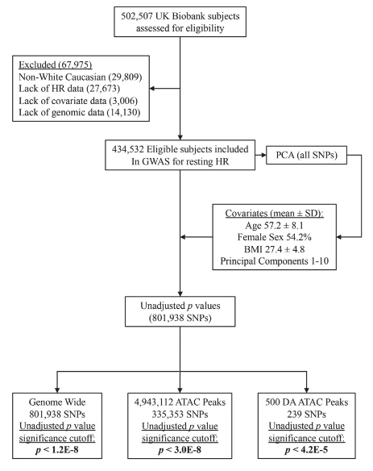

# ATAC-seq Reveals an Isl1 Enhancer that Regulates Sinoatrial Node Development and Function - GWAS Code

Vedantham Lab

To determine SNPs which correlate with variations in Resting Heart Rate, we conducted GWAS controlling for BMI, Sex, Age, and 10 Principal Components. We decided to conduct our own GWAS, rather than use the results of other papers, because the lack of publicly available data on all SNPs from these studies, rather than just statistically significant ones. We also wanted to control for BMI, which other papers did not. 

The following image details the pipeline used to analyze this data.

The full results have been published in Circulation Research. 

Galang G, Mandla R, Ruan H, Jung C, Sinha T, Stone NR, Wu RS, Mannion BJ, Allu PKR, Chang K, Rammohan A, Shi MB, Pennacchio LA, Black BL, Vedantham V (2020). [ATAC-seq Reveals an Isl1 Enhancer that Regulates Sinoatrial Node Development and Function](https://www.ahajournals.org/doi/abs/10.1161/CIRCRESAHA.120.317145). Circulation Research, 12 Oct. 2020.

This repository contains code used to conduct our analysis. 
